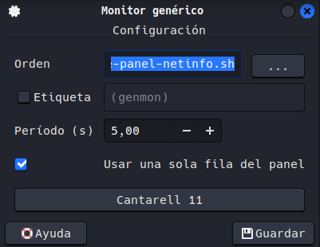

# Kali-Parrot Setup

Scripts para personalizar entornos **Kali Linux** o **Parrot OS**.

## Incluye

- zsh
- kitty
- bat desde release oficial de `sharkdp/bat` (con fallback a `batcat` en Debian/Kali)
- lsd
- flameshot
- Atajo `PrtSc` configurado para abrir `flameshot gui` (XFCE/GNOME, best-effort)
- Oh My Zsh
- Powerlevel10k
- zsh-autosuggestions
- zsh-syntax-highlighting
- zsh-sudo (plugin `sudo` de Oh My Zsh)
- Fuente `Hack Nerd Font`
- gomap
- Fondo por defecto empaquetado en `assets/` (`Walpaper.jpg` o `Wallpaper.jpg`) y copiado a `~/Pictures/`
- Modo visual opcional `--dark-katana` (Kali-Dark + Flat-Remix-Blue-Dark + Kitty en paleta katana)
- Widget en barra superior de XFCE con iconos de color para LAN/DOCKER/TARGET/VPN (usa ruta absoluta al script)
- En `--dark-katana`, Kitty queda con bloque gestionado (fuente, opacidad, tabs, mappings y paleta katana).

## Uso

```bash
chmod +x install.sh
./install.sh

# Estilo oscuro tipo katana (opcional)
./install.sh --dark-katana
```

## Estructura

- `install.sh`: orquestador principal (instalación y flujo).
- `templates/`: bloques reutilizables para mantener el script legible:
  - `p10k-user.zsh`, `p10k-root.zsh`
  - `zsh-managed-block.zsh`
  - `kitty-katana-dark.conf`, `kitty-managed.conf.tmpl`
  - `xfce-panel-netinfo.sh.tmpl`

## Alias y funciones añadidas

### Alias

- `cat`: usa `bat`.
- `catn`: `bat --style=plain`.
- `catnp`: `bat --style=plain --paging=never`.
- `ls`: usa `lsd --group-dirs=first`.
- `l`: `lsd --group-dirs=first`.
- `la`: `lsd -a --group-dirs=first`.
- `ll`: `lsd -lh --group-dirs=first`.
- `lla`: `lsd -lha --group-dirs=first`.
- `pyserver`: levanta servidor HTTP rápido en puerto 80 (`python3 -m http.server 80`).
- `tshow`: alias de `showtarget`.

### Funciones

- `settarget <valor>`: guarda el TARGET persistente en `~/.config/target` y exporta la variable `TARGET`.
- `showtarget`: muestra el valor actual de `TARGET`.
- `cleartarget`: limpia el TARGET guardado y desexporta `TARGET`.
- `testGo <nombre_maquina>`: crea estructura de directorios de trabajo (`enum/nmap`, `enum/web`, `burst`, `tmp`, `post`) y entra en `enum/nmap`.
- `extractPorts <archivo_nmap>`: extrae IP/puertos abiertos de salida de Nmap y copia los puertos al portapapeles si `xclip` está disponible.

## Notas

- El script está pensado para ejecutarse como usuario normal con permisos `sudo`.
- Si no tienes `sudo`, ejecútalo como root ajustando el entorno manualmente.
- Si quieres usar `zsh` como shell por defecto, el script intentará configurarlo automáticamente.
- Antes de modificar `~/.zshrc` y `~/.p10k.zsh`, el script crea backups en `~/.config/kali-parrot-setup/backups/<timestamp>/`.
- También respalda configuración de XFCE antes de tocar panel/atajos/fondo (`xfce4-panel.xml`, `xfce4-keyboard-shortcuts.xml`, `xfce4-desktop.xml`) en esa misma ruta.
- Configura también el entorno de `root` (Oh My Zsh + plugins + `.zshrc` + `.p10k.zsh`) con prompt rojo y calavera para `os_icon`, guardando backups de `/root/.zshrc` y `/root/.p10k.zsh` en la misma carpeta de backups.

## Widget (barra superior XFCE)


- El script crea el archivo del widget en `~/.local/bin/xfce-panel-netinfo.sh`.
- El widget muestra con iconos Nerd Font:
  - LAN (IP local de salida)
  - Docker (`docker0`)
  - TARGET (desde `~/.config/target`, configurable con `settarget`)
  - VPN (`tun0` / `turn0` / `wg0`)
- El comando del plugin se guarda con **ruta absoluta** para evitar errores de "fichero no encontrado".
- El script no reordena ni reconstruye el panel automáticamente (para evitar desconfigurarlo).

### Activación manual recomendada

1. En el panel XFCE: clic derecho `Panel > Add New Items...`
2. Añade `Generic Monitor`
3. Configura el comando como: `/home/TU_USUARIO/.local/bin/xfce-panel-netinfo.sh`
4. Intervalo recomendado: `5` segundos
5. Activa `Use markup` para colores/iconos
6. Quitar check de `Etiqueta`



### Solución rápida de problemas

- Si no aparece: reinicia panel con `xfce4-panel -r`
- Si no carga iconos: confirma fuente Nerd Font activa en el sistema
- Si `TARGET` sale vacío: usa `settarget <IP_o_host>` y luego `tshow`
